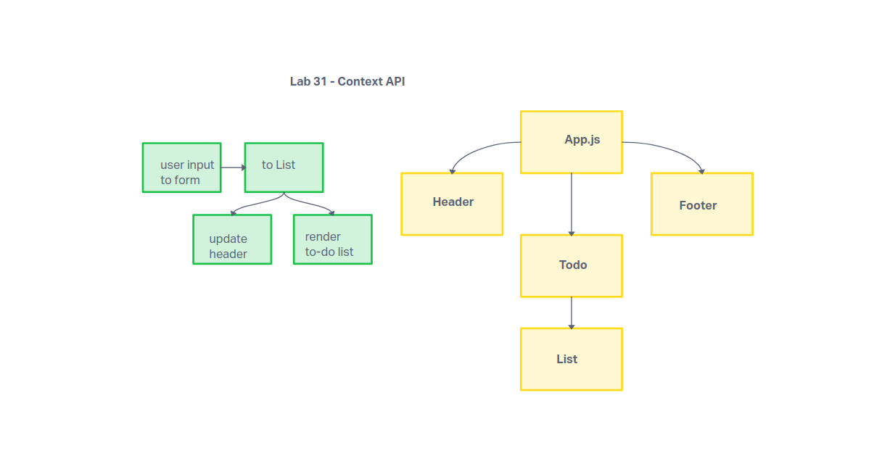

# Lab 31: To-Do App

This is a to-do list app built with React for the purpose of learning to use the Context hook for state management.  

## Features

CRUD functionality for tasks.

- Add tasks
- Delete tasks
- Update tasks
- Mark tasks as completed

### UML

